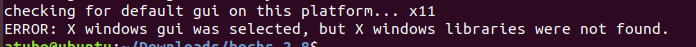
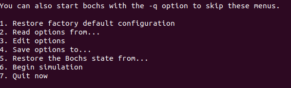

# 1、环境介绍
本次开发采用的是bochs虚拟机作为宿主环境，主机是Ubantu18.04。

# 2、bochs虚拟机安装、部署
## 安装bochs
1. 下载bochs: <https://sourceforge.net/projects/bochs/files/bochs/> 安装的是2.8版本  
2. 安装bochs  
```shell
tar -zxvf bochs-2.8.tar.gz

cd bochs-2.8

./configure \
--prefix=/yourpath-for-bochs \
--enable-debugger \
--enable-disasm \
--enable-iodebug \
--enable-x86-debugger \
--with-x \
--with-x11
```
执行./configure时报错：ERROR: X windows gui was selected, but X windows libraries were not found.  


如何解决：
```shell
sudo apt-get install libx11-dev xserver-xorg-dev xorg-dev
# 重新执行configure
./configure \
--prefix=/yourpath-for-bochs \
--enable-debugger \
--enable-disasm \
--enable-iodebug \
--enable-x86-debugger \
--with-x \
--with-x11

# 执行成功会生成Makefile
make
make install
``` 

3. 配置bochs  
安装完成后可以到自己设定的bochs安装目录中查看，有两个目录：bin、share
在bin目录下创建bochsrc.txt文件，作为bochs启动的配置文件
```shell
atubo@ubuntu:~/bochs/bin$ cat bochsrc.txt
###############################################
# Configuration file for Bochs
###############################################
#第一步,首先设置 Bochs 在运行过程中能够使用的内存,本例为 32MB 。
#关键字为 megs
megs: 32
#第二步,设置对应真实机器的 BIOS 和 VGA BIOS 。
#对应两个关键字为 : romimage 和 vgaromimage
romimage: file=/home/atubo/bochs/share/bochs/BIOS-bochs-latest
vgaromimage: file=/home/atubo/bochs/share/bochs/VGABIOS-lgpl-latest

#第三步,设置 Bochs 所使用的磁盘,软盘的关键字为 floppy。
#若只有一个软盘,目IJ使用 floppy a 即可,若有多个,则为 floppya, floppyb ...
#floppya: 1_ 44=a.img, status=inserted

#第四步,选择启动盘符。
#boot: floppy
#默认从软盘启动,将其注释
boot: disk
#改为从硬盘启动。我们的任何代码都将直接写在硬盘上,所以不会再有读写软盘的操作。

#第五步,设置日志文件的输出。
log: bochs.out

#第六步,开启或关闭某些功能。
#下面是关闭鼠标,并打开键盘。
mouse: enabled=0
keyboard: keymap=/home/atubo/bochs/share/bochs/keymaps/x11-pc-us.map
```

4. 启动bochs  
在bin目录执行./bochs，会看到如下界面  


选择6即可启动bochs