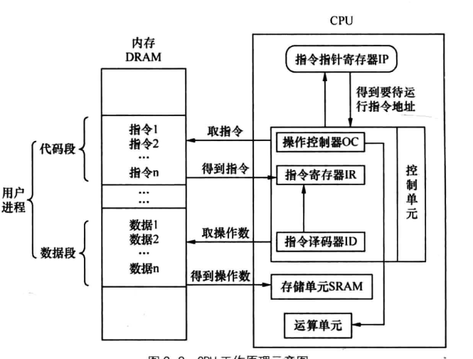
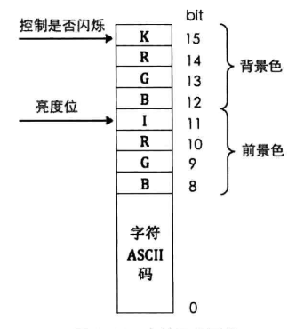
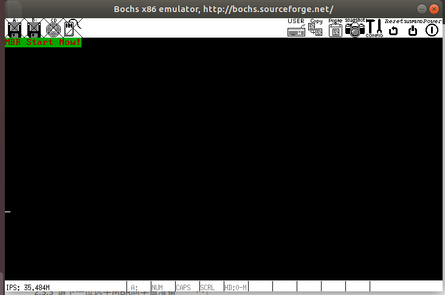
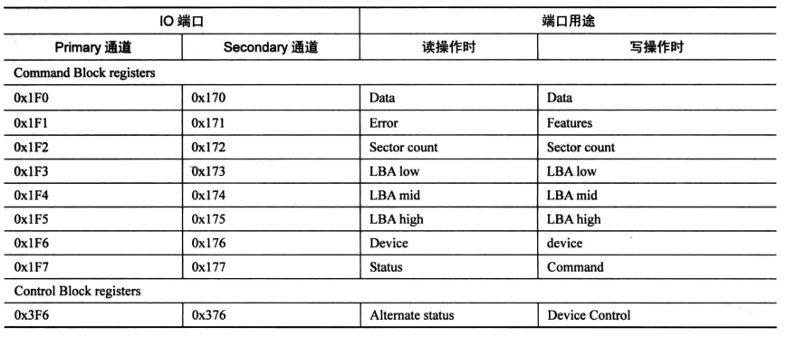
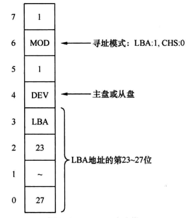
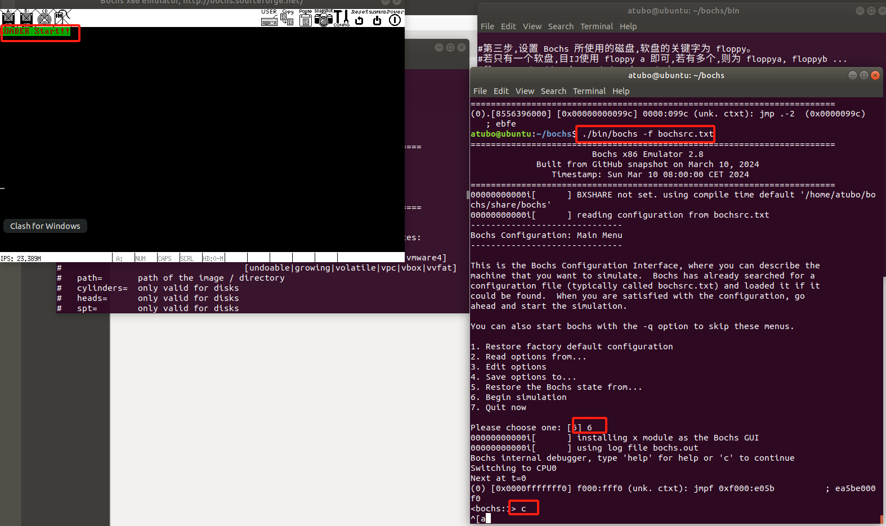

# MBR(Master Boot Record)主引导记录编写
## 1、计算机的启动过程
什么是载入内存？为什么要载入内存？  
1. 什么是载入内存：操作系统在加载应用程序时，是需要加载器将用户程序加载到内存中的。  
所谓的载入内存，实际分为2部分：  
- 程序被加载器加载到内存的某个区域；  
- CPU的cs:ip寄存器被指向这个程序的起始地址。  
当主机按下power键后，第一个运行的软件就是BIOS。于是会有以下问题：
- (1)、BIOS是由谁加载的？
- (2)、BIOS被加载到哪里？
- (3)、CPU的cs:ip是由谁修改的？

## BIOS(Base Input&Output System: 基本输入输出系统)软件
### 1、实模式下内存的布局(Intel 8086 1MB内存空间)
  
其中，地址0-0x9FFFF这部分地址为DRAM(Dynamic Random Access Memory: 动态随机访问存储)；  
地址0xF0000-0xFFFFF这64K内存为ROM(Read Only Memory: 只读存储器)。BIOS的代码就存储在这里，通常不会变，除非损坏；通常说的刷BIOS就是这个地方的代码。  
### 2、BIOS是怎么启动的
BIOS位于地址的0xF0000-0xFFFFF处，访问此处的地址就是访问BIOS，因此我们需要知道CPU如何去执行它的，即CPU的cs:ip值是如何组合为入口地址0xFFFF0的。  
在计算机开启的瞬间，CPU的cs:ip被强制初始化为0xF000:0xFFF0。而开机时处于实模式下，段的基地址需要乘以16(左移4位)，因此cs:ip=0xF000:0xFFF0对应的地址就是0xFFFF0。  
BIOS的入口地址0xFFFF0处存储的是一条指令：jmp far F000:E05B ; 跳转到地址0xFE05B处，此处才是BIOS代码真正开始的地方。  
BIOS的最后一项工作时校验启动盘中位于0盘0道1扇区的内容。如果此扇区的末尾两个字节分别是魔数0x55和0xaa，BIOS则认为此扇区存在可执行程序-->MBR，便会将此部分程序加载到物理地址0x7C00，随后跳转到此地址，继续执行。  

## MBR编写
### nasm简单用法
NASM（Netwide Assembler）是一款常用的 x86 汇编语言编译器，适用于编写低级系统程序或操作系统内核。下面是 NASM 的一些简单用法。  
```bash
nasm -f 输出格式 -o 输出文件名 输入文件名
# 将汇编文件编译为二进制
nasm -f bin -o mbr.bin mbr.asm
```
- -f：指定输出文件的格式，如 bin（纯二进制）、elf（Linux 可执行文件格式）、win32（Windows 32 位格式）等。  
- -o：指定输出文件的名称。  

### 2、dd 指令说明
dd 是一个用于复制和转换文件的命令，主要用于低级别的数据复制操作，例如制作磁盘映像、备份数据等。  
#### 常用参数
- if=文件（input file）：指定输入文件，即源文件路径。默认为标准输入。
- of=文件（output file）：指定输出文件，即目标文件路径。默认为标准输出。
- bs=字节数（block size）：设置块大小，即每次读写的数据量。常用值为 4M 或 1M，可以提高传输速度。
- count=块数：指定复制的块数量。bs 和 count 一起决定了总的复制数据量。
- skip=块数：跳过输入文件的前 N 个块，读取时从指定块后开始。
- seek=块数：跳过输出文件的前 N 个块，写入时从指定块后开始（输出文件会保留前面的内容）。
#### 进度与状态显示
- status=progress：显示实时进度。复制过程中会显示进度信息（速度和已传输数据量），这在大文件传输时尤为有用。
#### 数据转换参数
- conv=notrunc：不截断输出文件，保持输出文件的原始大小，防止文件被意外截断。
- conv=sync：将每个输入块填充到指定大小，未满部分用零填充。
- conv=noerror：忽略读取错误，遇到错误时继续操作。
- conv=ucase 和 conv=lcase：将数据转换为大写或小写字母（不常用）。
#### 用法示例
```bash
# 1、备份整个磁盘到文件
dd if=/dev/sdX of=/path/to/backup.img bs=4M status=progress
# 2、从磁盘映像恢复到磁盘
dd if=backup.img of=/dev/sdX bs=4M status=progress
# 3、擦除磁盘前 1MB 的数据
dd if=/dev/zero of=/dev/sdX bs=1M count=1
# 4、写入硬盘映像文件
dd if=mbr.bin of=hd60M.img bs=512 count=1 conv=notrunc
```

### 3、用例
简单用例，加载mbr后在屏幕上打印字符串：“MBR Start Now!”，源码参见 mbr.asm。  
- 编译生成img文件：
```shell
nasm -f bin mbr.asm -o mbr.bin
```  
- 将二进制文件写入磁盘映像  
```shell
dd if=mbr.bin of=yourpath/hd60M.img bs=512 count=1 conv=notrunc
```  
将img文件放到个人指定目录后，配置我们的bochsrc.txt文件：  
```shell
# 配置硬盘映像文件
ata0-master: type=disk, path="/youpath/hd60M.img", mode=flat, cylinders=1, heads=1, spt=1
```  

## MBR进一步完善
### 几个概念
- 地址：地址是描述各种符号在源程序中的位置，是源代码文件中各符号偏离文件开头的距离。  
- section：section称为节，可以用于将程序按照逻辑分为不同的区域块，是一个伪指令。  
- vstart：通过在section中使用vstart，可以被赋予一个新的虚拟起始地址。  
### CPU简单说明
CPU大体上分为3个部分：控制单元、运算单元、存储单元。  
控制单元：即CPU的控制中心，由指令寄存器IR(Instruction Register)、指令译码器ID(Instruction Decoder)、操作控制器OC(Operation Controller)组成。指令寄存器指针IP指向内存的下一条待执行的指令，控制单元则根据IP的指向将指令装在到IR中，然后由指令译码器ID按照指令格式来进行译码。  

### IO接口
IO接口是连接CPU与外设的逻辑控制部件，可分为硬件和软件两部分。硬件部分所做的都是一些实质的具体工作，其目的是协调CPU与外设之间的种种不匹配：如运算速度的不匹配、数据格式的不匹配。软件部分是指用来控制接口电路工作的驱动程序以及完成内部数据传输所需要的程序。  
### MBR改进：直接操作显卡进行显示
在实模式下直接将字符按照如下格式写入显存区域 0xB8000~BFFFF 这段用于文本显示的地址即可实现通过显卡显示：  
显卡显示字符的bit位(2个字节)：  
  
基于mbr.asm修改得到mbr_v1.asm
运行效果如下：绿底红字的字符闪烁：  


### MBR使用硬盘
#### 1、硬盘控制器的端口
硬盘常用的端口号：  
  
- data寄存器：负责数据管理，用于读取或写入数据；  
- error/feature寄存器：读取硬盘失败时记录失败信息； 尚未读取的数据记录在sector count寄存器；在写硬盘时，该硬盘有了别的功能，叫Feature寄存器，有些命令需要指定额外的参数就写在Feature寄存器中；  
- sector count寄存器：用来指定待读取或待写入的数据；  
LBA low、LBA mid、LBA high寄存器：三个8位宽度的寄存器用来分别存储LBA(Logical Block Address)的0-7、8-15、16-23位的地址，LBA共28位，剩余的4位在device寄存器的低4位中存储；  
- device寄存器： 低四位 0-3 用来存储LBA的 24-27 位地址；第4位用来指定通道上的主盘或从盘，0为主盘，1位从盘；第6位表示是否启用LBA寄存器，1表示启用LBA，0表示CHS(Cylinder Head Sector)模式；第5、7位固定位1，称为MBS位； 
  
- status/command寄存器：  
读硬盘时，为status寄存器，用来给出硬盘的状态信息：  
第0位：ERR，为1表示命令出错；第3位：data request位，1表示数据准备就绪可以读取；第6位：DRDY request位，为1表示硬盘准备就绪，在诊断硬盘时用；第7位：BSY位，为1表示硬盘忙碌中；其余位都无效暂不关注。  
写硬盘时，为command寄存器，主要用三个命令：  
identify：0xEC：硬盘识别；  
read sector：0x20：读扇区；  
write sector：0x30：写扇区；  
  

#### 2、常用的硬盘操作方法
操作步骤：  
1. 选择通道：向sector count寄存器写入待操作的扇区数；  
2. 向三个LBA寄存器写入操作扇区的起始地址的低24位；  
3. 向device写入LBA的高4位；置位第6位为1(LBA模式)；设置第4位选择主盘还是从盘；  
4. 向command寄存器寄存器写入命令；  
5. 读取status寄存器，判断工作是否完成；  
6. 若是读取操作，则将硬盘数据读出；  

硬盘数据传输方式：  
1. 无条件传送方式：应用此方式需要数据源设备随时准备好数据，CPU随时取用，如寄存器、内存。  
2. 查询传送方式：程序I/O，在传输前，程序先检测设备的状态，满足条件才能传送数据。
3. 中断传送方式：中断驱动I/O，数据源设备数据就绪后通过中断通知CPU来取。
4. 直接存储器存取方式(DMA)：CPU不直接从数据源取数据，数据源和内存进行传输，CPU直接取内存的数据，需要DMA控制器。  
5. I/O处理机传送方式：通过I/O处理机来控制数据的传送。  

#### 3、改造MBR实现硬盘读取
MBR总内存就512字节，无法直接为操作系统的内核准备好环境，也没法将内核加载到内存运行，需要一个内核加载器loader加载到内存，交接给loader来加载内核。  
参见mbr_v2.asm  
loader简单实现了一个假的加载器，目前只是用于打印一个字符串，表示我们已经从MBR进入到内核加载器的环节了：参见 loader.asm  
需要将loader.asm编译并写入我们的磁盘中：  
```bash
nasm -o loader.bin -I include/ loader.asm  
# 将loader.bin写入磁盘的第2扇区
dd if=loader.bin of=~/bochs/hd60M.img bs=512 seek=2 count=1 conv=notrunc  
# 调整磁盘大小为512的整数倍，否则执行会报错
truncate -s %512 hd60M.img
```  
然后再启动bochs，可见如下效果：  
  