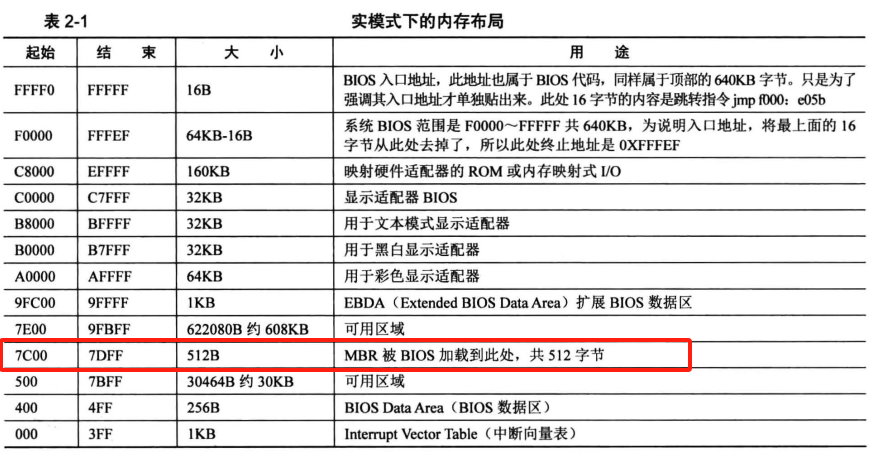

# MBR(Master Boot Record)主引导记录编写
## 1、计算机的启动过程
什么是载入内存？为什么要载入内存？  
1. 什么是载入内存：操作系统在加载应用程序时，是需要加载器将用户程序加载到内存中的。  
所谓的载入内存，实际分为2部分：  
- 程序被加载器加载到内存的某个区域；  
- CPU的cs:ip寄存器被指向这个程序的起始地址。  
当主机按下power键后，第一个运行的软件就是BIOS。于是会有以下问题：
- (1)、BIOS是由谁加载的？
- (2)、BIOS被加载到哪里？
- (3)、CPU的cs:ip是由谁修改的？

## BIOS(Base Input&Output System: 基本输入输出系统)软件
### 1、实模式下内存的布局(Intel 8086 1MB内存空间)
  
其中，地址0~0x9FFFF这部分地址为DRAM(Dynamic Random Access Memory: 动态随机访问存储)；  
地址0xF0000~0xFFFFF这64K内存为ROM(Read Only Memory: 只读存储器)。BIOS的代码就存储在这里，通常不会变，除非损坏；通常说的刷BIOS就是这个地方的代码。  
### 2、BIOS是怎么启动的
BIOS位于地址的0xF0000~0xFFFFF处，访问此处的地址就是访问BIOS，因此我们需要知道CPU如何去执行它的，即CPU的cs:ip值是如何组合为入口地址0xFFFF0的。  
在计算机开启的瞬间，CPU的cs:ip被强制初始化为0xF000:0xFFF0。而开机时处于实模式下，段的基地址需要乘以16(左移4位)，因此cs:ip=0xF000:0xFFF0对应的地址就是0xFFFF0。  
BIOS的入口地址0xFFFF0处存储的是一条指令：jmp far F000:E05B ; 跳转到地址0xFE05B处，此处才是BIOS代码真正开始的地方。  
BIOS的最后一项工作时校验启动盘中位于0盘0道1扇区的内容。如果此扇区的末尾两个字节分别是魔数0x55和0xaa，BIOS则认为此扇区存在可执行程序-->MBR，便会将此部分程序加载到屋里地址0x7C00，随后跳转到此地址，继续执行。  

## MBR编写

