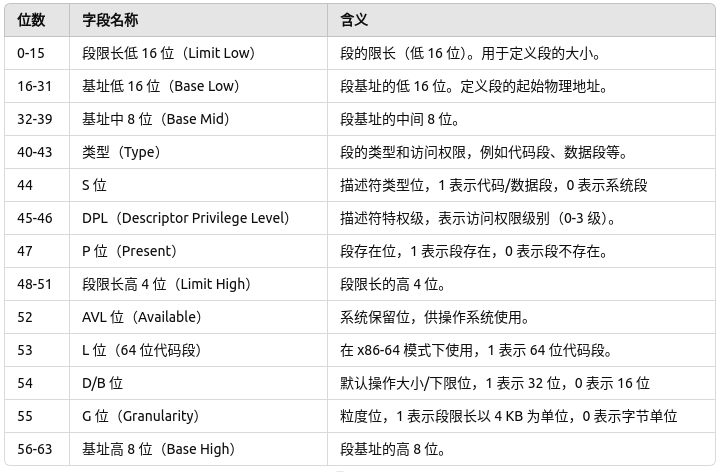
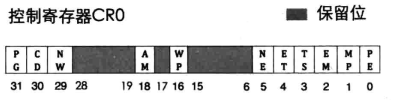
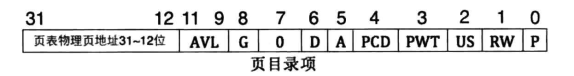
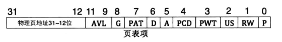

# 内核编写
## 一、保护模式&实模式
### 1、实模式和保护模式概述
在 x86 处理器架构中，保护模式和实模式是两种不同的运行模式，各自有不同的特性和应用场景。  
#### 实模式
实模式是 x86 处理器在启动时的默认模式，它模拟了早期的 8086 处理器环境，主要用于简单的操作系统和早期的 DOS 程序。  

**特点：**  
- 内存寻址：使用 20 位地址总线，可访问 1 MB 的内存（2^20 = 1MB）。  
- 分段寻址：使用段寄存器（如 CS, DS, SS, ES）进行分段寻址。内存地址由段寄存器和偏移量计算得出，段地址左移 4 位加上偏移量形成物理地址。  
- 无内存保护：程序可以直接访问全部内存，没有权限控制或内存隔离，可能导致不同程序相互干扰。  
- 简单环境：不支持虚拟内存、硬件级别的进程隔离、特权级等功能，只能运行单任务，适合小型或早期的系统。  

**用途：**  
- 主要用于引导程序、BIOS、DOS 系统以及一些早期的 16 位程序。  
- 引导加载器通常在实模式下启动操作系统（如 MBR 的执行）。  

#### 保护模式
保护模式是 80286 及以上处理器支持的一种模式，提供了更多的内存管理和保护机制。现代操作系统（如 Windows、Linux）都在保护模式下运行。  

**特点：**  
- 32 位地址空间：支持 32 位地址总线，可访问 4 GB 内存（2^32 = 4GB）。
- 段选择器和页表：使用段选择器和页表进行内存管理。段寄存器在保护模式下不直接存储段地址，而是作为段选择器，指向段描述符表，进一步划分内存。
- 内存保护：每个段都有访问权限和限长设置，可以有效保护内存区域，防止非法访问。
- 多任务和特权级：支持硬件级别的进程隔离和多任务调度。引入特权级（0-3 级），内核程序一般在 0 级，应用程序在 3 级，从而提供安全隔离。
- 虚拟内存：通过页表支持虚拟内存管理，使物理内存可以被映射到更大的虚拟地址空间，提高内存管理的灵活性。  

**用途:**  
- 现代操作系统内核都在保护模式下运行，以实现多任务、安全隔离和虚拟内存管理。
- 支持复杂系统的软件执行，包括现代应用程序和服务。

#### 对比
  
实模式主要用于系统启动阶段，保护模式则是现代系统运行的主要模式，能够充分利用处理器的高级功能。  

## 二、全局描述符
### 1、段描述符
在保护模式下，段描述符（Segment Descriptor）是存储在段描述符表（GDT 或 LDT）中的数据结构，用于定义内存段的属性。每个段描述符包含段的基址、限长、权限和其他控制信息。通过段描述符，保护模式可以实现灵活的内存管理和内存保护。  
一个段描述符占 8 个字节（64 位），其中包含了段的基址、限长以及访问控制字段。以下是段描述符的主要字段及其含义：  
  

**详细字段解释：**  
1. 段限长（Limit）：段限长定义了段的大小，表示段内的最大偏移地址。段限长的单位由 G 位决定：
- G 位 = 0：段限长以字节为单位，最大 1 MB（2^20 字节）。  
- G 位 = 1：段限长以 4 KB 为单位，最大 4 GB（2^32 字节）。    
2. 基址（Base）：段基址定义了段的起始地址。段基址分为低 16 位、中间 8 位和高 8 位，总共 32 位，用于定位段在内存中的起始位置。  
3. 类型（Type）：类型字段用于指定段的种类和访问权限。
- 代码段：指令执行方向、可读性等。
- 数据段：段是否可写、可读等。
- 系统段：如任务状态段（TSS），用于任务管理。  
4. S 位（Descriptor Type）：标识描述符的类型，1 表示代码段或数据段，0 表示系统段。  
5. DPL（Descriptor Privilege Level）：描述符的权限级别，共有 4 个特权级别（0-3），数值越小权限越高。
- 内核段通常设置为 0 级，应用程序段通常设置为 3 级。
6. P 位（Present）：段存在位，1 表示段存在于内存中，0 表示段不存在。如果程序尝试访问 P 位为 0 的段，会触发异常。  
7. G 位（Granularity）：粒度位，用于控制段限长的单位。1 表示限长以 4 KB 为单位，0 表示以字节为单位。  
8. D/B 位：默认操作大小/下限位。对于代码段，1 表示 32 位操作，0 表示 16 位操作。  
9. L 位（64 位代码段）：在 64 位模式下使用，1 表示 64 位代码段。此位仅在 x86-64 架构中有效。    

**段描述符的分类：**  
在保护模式下，段描述符分为以下几种类型：  
1. 代码段描述符：用于描述可执行代码的内存段。
- 可以设置段的可读性（只读或可读可执行）。
- 代码段通常在 Ring 0（内核）或 Ring 3（用户态）中使用。
2. 数据段描述符：用于描述存储数据的内存段。
- 可以设置段的读写权限（只读或可读写）。
- 数据段也可以根据需求设置特权级。
3. 系统段描述符：用于定义特殊用途的段，例如任务状态段（TSS）、局部描述符表（LDT）。
- 系统段的 S 位为 0。
- 任务状态段（TSS）描述符用于多任务管理，LDT 描述符用于进程独立的段管理。

**段描述符的工作过程：**  
1. 段选择器访问段描述符：在保护模式下，段寄存器存储的值称为段选择器，用于指向段描述符。  
2. 段描述符控制段的访问：段描述符中包含了段的基址、限长、类型和权限等信息。当程序访问内存段时，CPU 会检查段描述符的 P 位和 DPL 等字段，以确保访问符合权限。  
3. 地址转换：通过段基址和偏移量，CPU 计算出线性地址，再通过页表映射到物理地址（如果启用了分页机制）。  

### 2、全局描述符表(GDT)
全局描述符表（GDT，Global Descriptor Table） 是 x86 处理器在保护模式下用来定义内存段属性的核心结构。GDT 是一个数组，其中的每一项都是一个 8 字节（64 位）的段描述符，每个描述符定义一个段的基址、大小、权限等信息。GDT 允许操作系统对代码段、数据段、系统段（如 TSS 段）进行精细化的控制和保护。   

#### GDT 的作用
GDT 是保护模式内存管理的关键部分，主要作用包括：  
1. 定义内存段：通过段描述符，GDT 可以定义代码段、数据段和系统段的基址、限长和权限。  
2. 权限管理：通过特权级（DPL），GDT 可以设置不同段的访问权限，从而在多任务环境中实现内存隔离和安全。  
3. 任务管理：GDT 中包含 TSS 段描述符，可以用来进行任务切换，便于多任务系统的实现。  
4. 地址转换：GDT 配合段寄存器，实现逻辑地址到线性地址的转换。  

#### GDT 初始化步骤  
在进入保护模式之前，需要初始化 GDT 并加载到 GDTR 寄存器中。通常的步骤如下：  
1. 定义 GDT 表和段描述符：在内存中分配 GDT 空间，定义代码段、数据段和系统段（如 TSS 段）的描述符。  
2. 设置 GDTR 寄存器：使用 LGDT 指令将 GDT 的基地址和限长加载到 GDTR 寄存器。  
3. 切换到保护模式：设置 CR0 控制寄存器的 PE 位（保护模式启用位），然后跳转到保护模式下的代码。  
4. 加载段选择器：将段选择器加载到段寄存器中，使 CPU 使用 GDT 中的描述符来解析逻辑地址。  

#### GDT 示例
```asm
; 定义gdt
gdt_start:
    .quad 0x0000000000000000       ; GDT 的第一个描述符为 NULL 描述符
    .quad 0x00cf9a000000ffff       ; 代码段描述符，基址=0，限长=4GB，权限=可执行+只读
    .quad 0x00cf92000000ffff       ; 数据段描述符，基址=0，限长=4GB，权限=可读写

gdt_end:
gdt_ptr:
    .word gdt_end - gdt_start - 1  ; GDT 长度
    .long gdt_start                ; GDT 基址

;加载gdt
    lgdt [gdt_ptr]      ; 加载 GDT 基址和限长到 GDTR 寄存器
    mov eax, cr0
    or eax, 0x1         ; 设置保护模式位
    mov cr0, eax
    jmp CODE_SEG:init   ; 跳转到保护模式代码段
```

#### GDT 的重要性  
1. 内存隔离：GDT 配合 DPL 实现内存隔离，避免低权限代码访问高权限段。  
2. 系统安全性：GDT 提供的内存保护机制有助于实现用户态和内核态的隔离。  
3. 多任务管理：GDT 中可以包含 TSS 描述符，用于实现任务切换和进程管理。  

### 3、局部描述符(LDT)
局部描述符表（LDT，Local Descriptor Table） 是保护模式下的一种描述符表，类似于全局描述符表（GDT），用于管理段描述符。与 GDT 不同的是，LDT 主要用于进程或线程的局部内存管理，它提供了一种机制，使每个任务（例如进程）可以拥有自己的地址空间，从而实现进程间的内存隔离。  
#### LDT 的作用  
LDT 的作用是提供每个任务（通常是进程）一组专用的段描述符，用于定义进程的代码段、数据段和堆栈段等。这样可以实现以下功能：  
1. 内存隔离：每个进程的 LDT 可以独立定义段描述符，从而使进程可以拥有独立的内存空间。  
2. 特权控制：LDT 中的段描述符可以设置不同的特权级，控制访问权限。  
3. 灵活性：LDT 可以根据进程的需求定义不同的段，便于管理多任务系统。  

#### LDT 与 GDT 的区别
  

#### LDT 的使用过程
1. 定义 LDT 表：在内存中为每个任务创建一个 LDT，定义该任务的代码段、数据段和堆栈段描述符。
2. 加载 LDT：将 LDT 的基地址和限长加载到 LDTR 寄存器。每次任务切换时，操作系统会更新 LDTR，使新任务能够使用自己的 LDT。
3. 访问 LDT 段：通过段选择器的 TI 位选择 LDT，然后使用段选择器的描述符索引访问 LDT 中的段描述符。

#### LDT 示例
```asm
ldt_start:
    .quad 0x00cf9a000000ffff       ; 代码段描述符，基址=0，限长=4GB
    .quad 0x00cf92000000ffff       ; 数据段描述符，基址=0，限长=4GB

ldt_ptr:
    .word ldt_end - ldt_start - 1  ; LDT 的限长
    .long ldt_start                ; LDT 的基址

ldt_end:
```  
在这个示例中，我们定义了两个段描述符，一个用于代码段，另一个用于数据段。然后我们可以将 ldt_ptr 加载到 LDTR 中，切换到这个 LDT。  

#### LDT 的重要性
1. 进程隔离：LDT 使每个进程都可以拥有独立的内存段，从而实现进程间的隔离。
2. 灵活性：LDT 允许根据每个进程的需求定制段描述符，为系统的内存管理提供了灵活性。
3. 保护机制：通过 RPL 和特权级控制，可以避免低权限进程访问高权限段，从而提高系统安全性。

### 4、选择子(selector)
选择子（Selector） 是保护模式下的一种特殊值，用于在段寄存器中引用内存段。它并不直接包含段的基址或限长，而是一个索引，指向 GDT（全局描述符表）或 LDT（局部描述符表）中的一个段描述符。CPU 通过该段描述符来获取段的实际基址、大小和权限等信息，从而实现对段的访问和保护。  

#### selector 结构
选择子是一个 16 位的值，由以下几个部分组成：  
  

**各个字段的作用如下：**  
1. RPL（请求特权级）：用于指定选择子的特权级（0 到 3），其中 0 是最高级别，3 是最低级别。RPL 用于确定在不同特权级的访问控制中是否可以访问某个段。RPL 通常和段描述符中的 DPL（描述符特权级）一起工作，以判断是否允许当前代码访问某段。  
2. TI 位（表指示位）：用于指定选择子指向 GDT 还是 LDT：  
- TI = 0 表示指向 GDT。  
- TI = 1 表示指向 LDT。  
3. 描述符索引：用于在 GDT 或 LDT 中定位段描述符。描述符索引从 0 开始，指定选择子在描述符表中的具体位置。CPU 通过描述符索引，从 GDT 或 LDT 中找到对应的段描述符。  

#### selector 的使用
选择子通常被加载到段寄存器（如 CS、DS、SS 等）中，用于访问不同的内存段。在保护模式下，段寄存器存储的内容是一个选择子，而不是实际的段基址。加载选择子到段寄存器时，CPU 会自动根据选择子的 TI 位和描述符索引，从 GDT 或 LDT 中查找对应的段描述符。  

#### selector 工作机制  
当 CPU 需要访问某个段时，按照以下步骤工作：  
1. 加载选择子：将选择子加载到段寄存器，如 mov ax, selector 然后 mov ds, ax。
2. 解析选择子：CPU 根据选择子的 TI 位确定访问 GDT 还是 LDT。
3. 查找段描述符：根据描述符索引，在指定的描述符表中找到对应的段描述符。
4. 获取段属性：CPU 从段描述符中读取段基址、限长和访问权限等信息。
5. 访问段内容：根据段基址和偏移量（段内偏移）计算逻辑地址，再转换为线性地址，完成对段内容的访问。

#### 特权级检查
在保护模式下，CPU 使用 RPL、DPL（描述符特权级）和 CPL（当前特权级）来确定是否允许当前代码访问某个段。这些特权级控制机制确保了不同权限级别的代码只能访问允许的段，从而实现了内存保护。  

**特权级检查规则：**  
- 访问数据段：段的 DPL ≥ max(CPL, RPL)，则允许访问；否则拒绝访问。
- 访问代码段：段的 DPL = CPL，且段为可执行段，则允许访问；否则拒绝访问。 

## 三、进入保护模式
进入保护模式的步骤：  
1. 打开A20地址线；  
2. 初始化GDT；
3. 设置CR0寄存器，远跳转到保护模式代码段。  

### 1、打开A20地址线
A20 地址线决定了是否允许访问超过 1MB 的内存（即 20 位地址的限制）。开启 A20 地址线后，您可以使用 32 位地址来访问更大的内存空间。  
在进入保护模式之前，您需要确保 A20 地址线已经开启。否则，访问大于 1MB 的内存区域时，系统可能会发生错误。Bochs 和其他模拟器可以通过多种方式来控制 A20 地址线。  
在进入保护模式之前，A20 地址线通常需要通过一个特殊的端口或硬件寄存器来启用。为了在模拟环境中正确启用 A20 地址线，可以通过访问端口 0x92 来控制它。  
示例代码：  
```asm
ENABLEA20:
    in al, 0x92
    or al, 0x02
    out 0x92, al
```

### 2、加载 GDT
示例如下：  
```asm
;----- 定义GDT描述符信息 -----
GDT_START:
    ; NULL 描述符
    dq 0x0000000000000000
GDT_CODE:
    ; 代码段描述符
    dw 0xFFFF       ; 段限长低 16 位
    dw 0x0000       ; 基地址低 16 位
    db 0x00         ; 基地址中间 8 位
    db 10011010b    ; 段属性：执行/可读/非系统/代码段
    db 11001111b    ; 粒度/操作大小
    db 0x00         ; 基地址高 8 位

GDT_DATA:
    ; 数据段描述符
    dw 0xFFFF       ; 段限长低 16 位
    dw 0x0000       ; 基地址低 16 位
    db 0x00         ; 基地址中间 8 位
    db 10010010b    ; 段属性：可读/写/非系统/数据段
    db 11001111b    ; 粒度/操作大小
    db 0x00         ; 基地址高 8 位

GDT_END:

gdtr:
    dw GDT_END - GDT_START - 1  ; GDT 的限制
    dd GDT_START                ; GDT 的基地址


;----- 加载GDT描述符信息 -----
lgdt [gdtr]
```

### 3、进入保护模式
- 设置寄存器CR0的PE位为1，CR0寄存器如下图：  
  
示例代码：  
```asm
    mov eax, cr0
    or eax, 0x00000001
    mov cr0, eax
```
- 远跳转到保护模式代码段  
示例代码：  
```asm
    jmp dword SL_CODE:p_mode_start
```

## 四、物理内存获取
BIOS 中断 0x15 是用于获取和管理系统内存的信息。具体来说，功能号 0xE820 可以通过 BIOS 中断 0x15 来获取系统的物理内存信息。这在操作系统启动阶段，特别是内核引导程序中，常用于获取系统的内存布局和总内存大小。  
### 1、中断调用流程：
1. 调用：int 0x15，功能号 0xE820，获取物理内存区域的信息。  
2. 参数：
- EAX = 0xE820：表示请求内存区域信息。  
- EBX = 0：为零，表示从地址 0 开始查询内存区域。  
- ECX = 24：表示请求返回的信息块的大小（字节数），通常为 24 字节（每个内存块）。  
- EDX = 0x534D4150：用于确认调用是否有效，通常使用此值表示支持该调用。  
3. 返回值：  
- ESI：返回内存块的物理起始地址。  
- ECX：返回内存块的大小（单位：字节）。  
- EBX：返回内存块类型。  
- EAX：返回一个状态码，通常是 0x534D4150（'SMAP'）来标识成功。  
4. 返回结构：  
```asm
; 返回结构格式
struct MemoryMapEntry:
    QWORD baseAddress      ; 内存块的物理起始地址
    QWORD length           ; 内存块的长度（字节）
    DWORD type             ; 内存块类型（例如，0x01 表示可用内存）
    DWORD padding          ; 填充，通常为 0
```

## 五、内存分页
内存分页（Paging）是操作系统和计算机硬件管理内存的一种技术，其主要目的是解决内存管理中的一系列问题。  
### 1、内存为什么要分页
1. 避免内存碎片
- 内存碎片 是指内存空间在长期使用过程中因分配和回收不均匀，导致的不可用空间。主要有两种类型：  
外部碎片：在物理内存中，空闲的内存块在空间上分散，不连续，无法有效利用。  
内部碎片：内存块的分配过大，导致一部分内存未被使用，造成浪费。   
- 分页机制 将内存分割成固定大小的页面，不管进程分配的内存是否连续，都会通过页表映射到物理内存中的不同位置，从而避免了外部碎片的问题。  
- 内存分页 通过对内存块的统一管理，使得内存可以高效地利用，避免了传统内存管理方式中的碎片问题。   
2. 支持虚拟内存
- 虚拟内存 是一种使得计算机能够使用比实际物理内存更多的内存空间的技术。通过分页，操作系统可以将程序所需的内存空间分为多个页面，并将这些页面从硬盘交换到物理内存中，虚拟内存的大小理论上可以远远超出物理内存的限制。  
- 在没有分页的情况下，操作系统必须要求进程的内存地址空间完全适配物理内存，这会限制程序的内存需求和资源的分配。而分页允许操作系统使用硬盘作为扩展内存，使得程序能够在物理内存不够用时，依然能够运行。  
3. 内存保护
- 内存分页为每个进程提供了内存保护，通过地址转换（从虚拟地址到物理地址的映射），每个进程只能访问其分配的虚拟内存，而不能访问其他进程的内存区域。  
- 操作系统通过页表管理内存的映射，确保程序无法越界访问内存。每个页表条目通常会包含访问权限（如读、写、执行权限），如果程序试图访问不允许的内存区域，操作系统会产生保护异常，防止程序破坏或泄露其他程序的数据。  
4. 简化内存管理
- 分页使得内存管理更加简化和高效。在没有分页的系统中，内存分配需要考虑到连续性和大小等复杂的因素，而分页将内存划分为固定大小的页，使得内存的分配和回收变得更加简洁。  
- 每个页面的大小固定（通常为 4KB），操作系统可以快速管理内存，并减少了内存碎片的产生。此外，分页机制还使得程序加载、内存共享、代码重用等变得更加容易。  
5. 支持多任务
- 内存分页使得操作系统能够在多任务环境中有效地隔离不同进程的内存空间。当多个进程运行时，每个进程有自己的虚拟地址空间，操作系统通过页表来将每个虚拟地址空间映射到不同的物理内存页面，进程之间相互隔离。  
- 通过分页，操作系统可以保证每个进程在自己的虚拟地址空间中执行，而不受其他进程的影响，实现了多任务的内存隔离和安全。  
6. 提高内存访问的效率
- 在没有分页的系统中，程序必须知道物理内存的具体地址，而这通常会导致较高的复杂度。分页机制通过引入页表，使得虚拟地址和物理地址的转换更加灵活，访问物理内存时，硬件可以通过查表来找到物理地址，从而使得内存管理更加高效。  
- 另外，现代 CPU 支持 TLB（Translation Lookaside Buffer），它是一个高速缓存，用于缓存虚拟地址到物理地址的转换结果，从而加速地址转换过程，进一步提升内存访问的效率。  
7. 提高内存的共享性
- 分页机制还允许多个进程共享同一块内存。例如，多个进程可以映射同一个页面，从而实现内存共享。这种技术在实现共享库（Shared Libraries）和进程间通信（IPC）时非常有用。  
- 由于内存分页将内存分割为页面，操作系统可以更加灵活地在多个进程之间共享内存资源，而不必担心进程的内存空间重叠或互相影响。  
8. 实现需求分页（Demand Paging）
- 需求分页 是一种优化内存使用的技术。它意味着在程序运行时，只有在需要时才将程序的页面从磁盘加载到内存，而不是一次性加载整个程序。  
- 通过分页机制，操作系统能够按需将程序的页面加载到物理内存中，而不必一次性加载所有页面，这种方式减少了内存的压力，提高了系统的运行效率。  

### 2、页表
#### 一级页表
- 概念：1级页表是最简单的分页方式，只有一个页表。  
- 使用方式：虚拟地址分成两部分，一部分用于查找页表项（PT），另一部分是页内偏移。  
- 映射过程：  
虚拟地址的高位部分作为索引，用于直接查找页表中的项，该项指向物理页面。  
虚拟地址的低位部分是页内偏移，直接添加到物理页面基地址中，形成最终的物理地址。  
- 优点：结构简单，适用于小地址空间的映射。  
- 缺点：在地址空间较大时，占用的页表空间较大。比如，32位地址空间（4GB）分页时，1级页表会占用非常多的内存

#### 二级页表
- 概念：2级页表使用**页目录**和**页表**两级结构，分级查找来减少页表的大小。  
- 使用方式：虚拟地址分成三部分，一部分用于索引页目录项（PD），一部分用于索引页表项（PT），最后一部分是页内偏移。  
- 结构：  
页目录：页目录项指向不同的页表，每个页表负责映射一个较小范围的虚拟地址空间。  
页表：页表项指向物理页面，每个页表项描述一个具体的物理页面。  
- 映射过程：  
虚拟地址的高位部分用于索引页目录项，页目录项指向一个页表。  
中间的位用于索引页表项，页表项最终指向一个物理页面。  
最后，虚拟地址的低位部分作为页内偏移，加上物理页面的基地址，形成最终的物理地址。  
- 优点：在地址空间较大时减少页表的占用空间，分页表可以更加灵活地加载。
- 缺点：比1级页表增加了访问的复杂性，但更高效地管理了内存。

虚拟地址划分：  
| 页表级别 | 高位 | 中间位 | 低位 (页内偏移) |
| :-----: | :--- | :--- | :--------: |
| 1级页表 | 页表索引 (20位) | - | 12位 (4KB 页内偏移) |
| 2级页表 | 页目录索引 (10位) | 页表索引 (10位) | 12位 (4KB 页内偏移) |

二级页表对应的结构：  
  
  

### 3、页表设计
1. 在32位系统中，虚拟地址是一个32位的值，因此虚拟地址空间范围为 0x00000000 到 0xFFFFFFFF，共计 4GB 的虚拟内存。  
2. 虚拟地址通过页目录和页表（二级页表）被映射到物理地址空间，虚拟地址分为三部分：  
- 高10位：用于索引页目录项（每项4字节，共1024项）。  
- 中间10位：用于索引页表项（每项4字节，共1024项）。  
- 低12位：用于页内偏移（每页大小4KB）。  
3. 用户态和内核态的划分（通常情况下）：  
- 用户空间：地址范围为 0x00000000 到 0xBFFFFFFF，通常为 3GB，供用户进程使用。
- 内核空间：地址范围为 0xC0000000 到 0xFFFFFFFF，通常为 1GB，供操作系统内核和内核态的进程使用。  
此划分方案（3GB 用户空间 + 1GB 内核空间）是典型的划分方式，许多操作系统（如 Linux）在 32 位模式下使用这种方式，但这可以由系统设计自行决定。  

### 4、TBL(Translation Lookaside Buffer)
在使用分页的内存管理系统中，CPU每次访问内存时都需要通过页表将虚拟地址转换为物理地址。然而，访问页表需要时间，尤其是多级页表可能会导致更高的开销。TLB 缓存最近使用的页表条目，减少了对页表的查找需求，从而加速了地址转换过程。  
当 CPU 访问一个虚拟地址时，TLB 首先检查这个地址是否已经在 TLB 中缓存：  
- TLB 命中（Hit）：如果地址在 TLB 中找到，直接使用缓存的物理地址映射，无需再访问页表。  
- TLB 未命中（Miss）：如果地址不在 TLB 中，则需要访问页表来进行转换，并将新的映射加载到 TLB 中。  

## 六、ELF文件
ELF（Executable and Linkable Format）文件是一个模块化的二进制文件格式，被广泛用于 Unix 和 Linux 系统中，支持可执行文件、目标文件、共享库和核心转储文件。ELF 文件结构的主要组成部分如下：   

**ELF 文件结构的组成**  
1. ELF Header（ELF 文件头）  
2. Program Header Table（程序头表）  
3. Sections（节）  
4. Section Header Table（节头表）  

### 1、ELF Header（ELF 文件头）
ELF Header 位于 ELF 文件的开头，定义了文件的基本属性，如类型、机器架构、入口地址等。其格式如下：  
e_ident：文件标识符，通常是一个包含 ELF 魔数的数组（0x7F 'E' 'L' 'F'），用于识别文件为 ELF 格式。  
e_type：文件类型，包括 ET_EXEC（可执行文件）、ET_REL（目标文件）等。  
e_machine：机器架构，比如 EM_386 表示 Intel 80386。  
e_version：ELF 版本，通常为 1。  
e_entry：程序入口地址，即 CPU 从该地址开始执行代码。  
e_phoff：程序头表的偏移位置（从文件开始到程序头表的字节数）。  
e_shoff：节头表的偏移位置。  
e_flags：处理器相关的标志。  
e_ehsize：ELF Header 的大小。  
e_phentsize：程序头表中每个条目的大小。  
e_phnum：程序头表的条目数量。  
e_shentsize：节头表中每个条目的大小。  
e_shnum：节头表的条目数量。  
e_shstrndx：指向字符串表的索引，通常用于存储节名。  

### 2、Program Header Table（程序头表）
程序头表是一个描述各段如何加载到内存中的数据结构，尤其用于操作系统在加载文件时使用。它包含一个条目列表，每个条目描述一个段。关键字段如下：  
p_type：段的类型，如 PT_LOAD（加载段）、PT_DYNAMIC（动态段）。  
p_offset：段在文件中的偏移地址。  
p_vaddr：段在内存中的虚拟地址。  
p_paddr：段在物理内存中的地址（用于系统引导时）。  
p_filesz：段在文件中的大小。  
p_memsz：段在内存中的大小。  
p_flags：段的标志，如可执行、可写、只读等。  
p_align：段在文件和内存中的对齐要求。  
**常用段类型包括：**  
.text 段：代码段，包含可执行指令。  
.data 段：数据段，包含已初始化的全局变量。  
.bss 段：未初始化的数据段，包含未初始化的全局变量，加载时会被置为零。  

### 3、Sections（节）
Sections 是 ELF 文件中具体的代码和数据部分。常见的 Sections 包括：  
.text：包含程序的可执行代码。  
.data：已初始化的全局和静态数据。  
.bss：未初始化的全局和静态数据，不占用文件大小。  
.rodata：只读数据，比如字符串常量。  
.symtab 和 .strtab：符号表和字符串表，分别用于保存符号和符号名称。  
.rel.text 和 .rela.text：包含重定位条目，提供符号地址的更新信息。  
.debug：用于调试的附加信息。  

### 4、Section Header Table（节头表）
节头表描述每个节的信息。它的每个条目描述一个 Section 的属性，包含如下字段：  
sh_name：节名索引，指向字符串表 .strtab 中的一个偏移。  
sh_type：节的类型，如 SHT_PROGBITS、SHT_SYMTAB。  
sh_flags：节的标志，如可写、可分配、可执行。  
sh_addr：节在内存中的地址。  
sh_offset：节在文件中的偏移。  
sh_size：节的大小。  
sh_link：链接信息，依赖于具体的节类型。  
sh_info：额外信息，如节中符号的数量。  
sh_addralign：节的对齐要求。  
节头表通常是链接器使用的主要表，用于确定不同段和符号的关联关系。  

### 5、ELF 文件的加载与执行
当操作系统加载 ELF 文件时，会执行以下步骤：  
读取 ELF Header，验证文件格式、架构和入口点等基本信息。  
读取 Program Header Table，根据其信息将 .text、.data、.bss 等段映射到内存中指定位置。  
加载依赖库（如果是动态链接文件），处理符号解析和重定位。  
转到 e_entry 指定的入口地址，开始执行程序。  

### 6、使用 readelf 和 objdump 查看 ELF 结构
```bash
# 查看 ELF 文件头
readelf -h program
# 查看程序头表
readelf -l program
# 查看节头表
readelf -S program
# 反汇编 ELF 文件
objdump -d program
```

### 7、ELF 的一些重要特性
- 跨平台：ELF 可以支持不同的 CPU 架构。  
- 模块化：ELF 的分段设计和节头表，使得它非常适合链接、动态加载和共享库。  
- 灵活性：可以用于目标文件、可执行文件、共享库和核心转储文件。  

