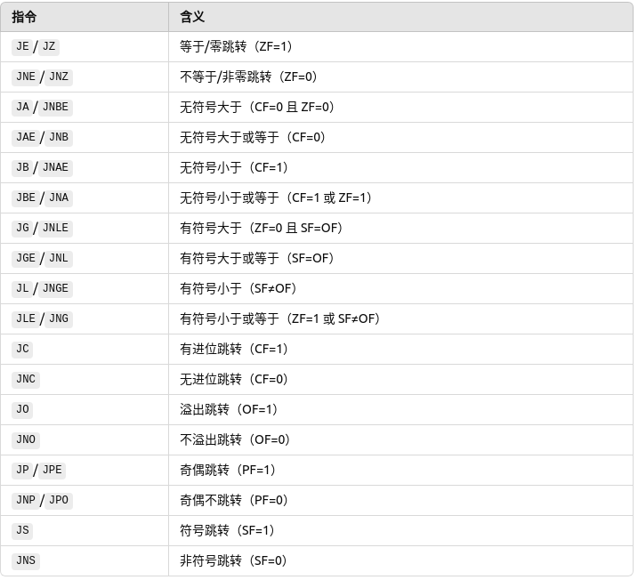

# 汇编语法记录
## 常用寄存器
### 1、通用寄存器
#### 16 位通用寄存器
- AX (Accumulator Register)：累加器，用于算术和数据传输操作。可以拆分为两个 8 位寄存器 AH (高 8 位) 和 AL (低 8 位)。
- BX (Base Register)：基址寄存器，通常用于存储基地址，支持直接、间接寻址。可以拆分为 BH (高 8 位) 和 BL (低 8 位)。
- CX (Count Register)：计数寄存器，常用于循环和字符串操作中的计数。可以拆分为 CH (高 8 位) 和 CL (低 8 位)。
- DX (Data Register)：数据寄存器，主要用于 I/O 操作和乘除运算。可以拆分为 DH (高 8 位) 和 DL (低 8 位)。
#### 32 位通用寄存器（在 32 位模式下）
EAX、EBX、ECX、EDX：分别是 AX、BX、CX 和 DX 的 32 位扩展，常用于处理 32 位的数据。
#### 64 位通用寄存器（在 64 位模式下）
RAX、RBX、RCX、RDX：分别是 AX、BX、CX 和 DX 的 64 位扩展，适用于处理 64 位的数据。

### 2、指针寄存器
指针寄存器用于存储数据或指令的地址信息，尤其在栈操作和指针寻址中经常使用。

- SP (Stack Pointer)：栈指针寄存器，指向当前栈顶位置，用于栈操作。32 位扩展为 ESP，64 位扩展为 RSP。
- BP (Base Pointer)：基址指针寄存器，通常用于存储函数调用的基地址。32 位扩展为 EBP，64 位扩展为 RBP。
- IP (Instruction Pointer)：指令指针寄存器，指向下一条将要执行的指令的地址。32 位扩展为 EIP，64 位扩展为 RIP。RIP 在 64 位模式下常用于实现 RIP 相对寻址。

### 3、 索引寄存器
索引寄存器通常用于数组和字符串操作，可配合基址寄存器实现复杂的地址计算。  

- SI (Source Index)：源索引寄存器，在字符串操作中指定源地址。32 位扩展为 ESI，64 位扩展为 RSI。
- DI (Destination Index)：目的索引寄存器，在字符串操作中指定目标地址。32 位扩展为 EDI，64 位扩展为 RDI。

### 4、段寄存器
段寄存器用于指定当前数据段、代码段或栈段的起始地址。它们主要用于 16 位模式下的内存分段寻址，较少用于现代 32 位和 64 位模式。  

1. CS (Code Segment)：代码段寄存器，指向当前代码段的起始地址。  
- 在实模式下，CS用于保存代码段的基址，和IP(指令指针寄存器配合)，形成实际的物理地址，用于取指令。  
物理地址计算：物理地址 = CS * 16 + IP；  
- 在保护模式下，CS保存的是段选择子，用来从GDT或者LDT中选择段描述符。段描述符中包含段基址、段界限和段权限等信息。  
CS的作用：指定当前代码段的基址；确定代码段的访问权限；在保护模式下进行特权级转换。  
2. DS (Data Segment)：数据段寄存器，指向当前数据段的起始地址。  
- 在实模式下，DS用于保存数据段的基址，在内存中存放全局变量、常量等数据。  
- 在保护模式下，DS保存数据段选择子，指向GDT或LDT，用于获取段基址、段界限和段权限。  
3. SS (Stack Segment)：栈段寄存器，指向当前栈段的起始地址。
- 实模式下，SS保存栈段的段基址，栈操作PUSH和POP默认使用SS作为段寄存器。  
- 保护模式下，SS保存段选择子，指向GDT或LDT中的段描述符，获取栈段的段基址、段界限和段权限；和栈指针ESP/SP配合实现对栈的访问。  
4. ES、FS、GS：附加段寄存器，用于扩展内存访问，FS 和 GS 在现代操作系统中也常用于存储线程本地存储（TLS）等特殊数据。

### 5、状态寄存器（标志寄存器）
状态寄存器包含了当前处理器状态的标志位，这些标志位反映了前一个运算的结果，并影响条件跳转和其他操作。  

常用的标志位：  
- CF (Carry Flag)：进位标志，用于检测无符号运算的溢出。
- ZF (Zero Flag)：零标志，结果为零时设置该标志。
- SF (Sign Flag)：符号标志，结果为负时设置该标志。
- OF (Overflow Flag)：溢出标志，用于检测有符号运算的溢出。
- PF (Parity Flag)：奇偶标志，结果的低 8 位中 1 的个数为偶数时设置。
- AF (Auxiliary Carry Flag)：辅助进位标志，用于 BCD 运算。
- DF (Direction Flag)：方向标志，控制字符串操作的方向。
- IF (Interrupt Flag)：中断标志，控制外部中断的允许与禁止。

### 6、控制寄存器
控制寄存器主要用于操作系统和特权模式下的 CPU 控制。

- CR0：控制寄存器 0，控制 CPU 的工作模式，如实模式和保护模式。
- CR2：包含导致最近一次页面错误的线性地址。
- CR3：页目录基址寄存器，用于内存分页。
- CR4：控制寄存器 4，启用或禁用一些 CPU 扩展功能。

### 7、调试寄存器（DR0-DR7）
调试寄存器用于硬件调试，包含了调试地址和控制信息，在调试程序和操作系统开发中常用。

### 8、扩展的 SIMD 寄存器（MMX、SSE、AVX）
- MMX 寄存器  
MM0-MM7：64 位寄存器，主要用于多媒体处理和 SIMD（单指令多数据）操作。
- SSE 寄存器  
XMM0-XMM15（64 位模式下）：128 位寄存器，用于浮点数和 SIMD 操作。
- AVX 寄存器  
YMM0-YMM15（64 位模式下）：256 位寄存器，用于高级 SIMD 操作。
- AVX-512 寄存器  
ZMM0-ZMM31（64 位模式下）：512 位寄存器，用于大量数据的 SIMD 操作。  
这些寄存器是 x86 架构中的核心组成，现代应用程序和操作系统通常会结合使用它们，以实现高效的数据处理和控制。

## 常用功能号
### 1、int 0x10-显示服务
| 功能号 (AH) | 功能描述 | 参数 |
| :-----: | :--- | :--------: |
| 0x00 | 设置视频模式 | AL = 模式编号 |
| 0x01 | 设置光标形状 | CH = 起始行，CL = 结束行 |
| 0x02 | 设置光标位置 | DH = 行，DL = 列，BH = 页号 |
| 0x03 | 读取光标位置和形状 | 输出：DH = 行，DL = 列，BH = 页号 |
| 0x06 | 滚屏窗口（清屏） | AL = 行数，BH = 颜色，CX 和 DX 指定窗口范围 |
| 0x09 | 在光标位置显示字符并保留属性 | AL = 字符，BL = 颜色，CX = 重复次数 |
| 0x0E | 显示字符并前移光标 | AL = 字符，BH = 页号，BL = 属性
| 0x13 | 显示字符串 | AL = 01/00 (光标是否跟随), BH = 页号, BL = 颜色, CX = 字符串长度, BP = 字符串地址 |

### 2、int 0x13 磁盘服务
| 功能号 (AH) | 功能描述 | 参数 |
| :-----: | :--- | :--------: |
| 0x00 | 复位磁盘驱动器 | DL = 驱动器号 |
| 0x02 | 从磁盘读取扇区 | AL = 扇区数, CH = 柱面号, CL = 扇区号, DH = 磁头号, DL = 驱动器号, ES = 缓冲区地址 |
| 0x03 | 向磁盘写入扇区 | 与读取参数相同 |
| 0x08 | 获取驱动器参数 | DL = 驱动器号 |
| 0x15 | 获取硬盘参数 | DL = 驱动器号 |

### 3、int 0x15 系统服务
| 功能号 (AH) | 功能描述 | 参数 |
| :-----: | :--- | :--------: |
| 0x86 | 等待（定时器） | CX:DX 设置等待时间 |
| 0x88 | 检查扩展内存 | AX 返回内存大小 |
| 0xC0 | 检查是否存在 APM | AX 返回是否支持 APM |
| 0xE801 | 检查扩展内存（>64MB） | AX 和 BX 返回内存 |
| 0xE820 | 获取系统内存映射 | ES:DI 指向返回信息 |
| 0x5300 | 检查是否支持 APM | AX 返回是否支持 APM |

## 常见指令
### 1、数据传输指令

### 2、算数运算指令

### 3、逻辑运算指令

### 4、位操作指令

### 5、控制指令
**无条件跳转指令**  
  
**条件跳转指令**  
  
### 6、字符串处理指令
  
### 7、标志控制指令
  
### 8、系统控制指令
  

## 常见用法
### 1、loop指令
```asm
loop label
```  
- label是标号
- 寄存器CX用于控制循环次数
- 每次执行loop指令时，CX会自动减1
- CX不为0，程序会跳转到label位置；CX为0则循环停止。  

### 2、远跳转
在计算机编程中，远跳转（far jump）是一种汇编语言的跳转指令，通常用于从一个代码段跳转到另一个代码段。与一般的近跳转（near jump）不同，远跳转不仅改变指令指针（EIP/RIP），还会改变代码段选择子（CS）。这在进入保护模式时或在不同代码段之间切换时非常重要。  
```asm
jmp segment:offset
```  
- segment：目标段的选择子（selector），即代码段的段寄存器 CS 的值。
- offset：段内偏移量，即指令指针（EIP 或 RIP，取决于 16/32 位或 64 位模式）的值。  

远跳转应用场景：  
1. 进入保护模式；  
2. 切换代码段；  
3. 实模式下跳转代码；  

远跳转与GDT/LDT：  
在保护模式下，远跳转依赖于 GDT（全局描述符表）或 LDT（局部描述符表）的设置。选择子 segment 实际上对应于 GDT 或 LDT 中的一个段描述符，该描述符包含了段的基地址、段限长以及段属性。  
例如，如果代码段的选择子 0x08 对应的 GDT 项中基地址为 0x00000000，那么 jmp 0x08:0x00000010 将跳转到物理地址 0x00000010。  

远跳转实现原理：  
远跳转在执行时，首先会根据段选择子（如 0x08）查找对应的段描述符，加载其基地址，将新的基地址与偏移量组合成新的物理地址，然后更新指令指针 EIP（或 RIP）并跳转到新的地址。这个过程**刷新了 CPU 的流水线**，以确保正确进入新的段。  

### 3、SGDT
SGDT（Store Global Descriptor Table）指令用于将全局描述符表（GDT）的位置和大小存储到指定的内存位置。GDT 是 x86 架构中用于分段内存管理的一个重要表，包含描述各段的段描述符。  
```asm
sgdt [gdtr_data]
```

### 4、内联汇编
内联汇编的格式：  
```asm
asm volatile("instruction" : output : input : clobbers);
```  
- asm：声明这是一个内联汇编语句。  
- volatile：提示编译器不要优化这段指令，即使它看似没有副作用。  
- instruction：指令部分  
: 后的部分：  
- output：指定输出寄存器。  
- input：指定输入寄存器。  
- clobbers：声明这条汇编可能修改的寄存器或内存状态，如 memory。  
